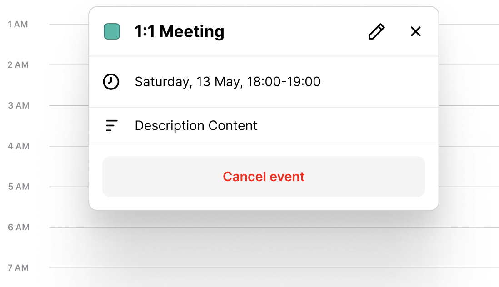

# Test Project

In this test project, you will implement a simple event popup using the given GraphQL endpoint. The UI design is as follows:

## Tasks

1. **Recreate the Popup UI**. Implement the popup UI based on the provided design. The background and other components are optional—only the popup itself is required.

2. **Display Event Details**. Use the `getTestEvent` query from the given GraphQL endpoint to fetch and display the following the test event's title, description, start and end times.

3. **Update Event on "Cancel"**. Add a "Cancel Event" button to the popup. When clicked, the button should update the event title to **"Canceled Test Event"** directly in the Apollo cache. No additional network requests should be made for this step, as the goal is to demonstrate a cache update.

## Additional Instructions

1. Please use the provided libraries to implement this project (i.e. React, Apollo GraphQL, Antd, the Popover component from @reactour), but feel free to include additional utility libraries if they make your implementation easier or more efficient.
2. Focus on implementing the popup UI as closely as possible to the provided design.
3. Submit the final deliverable as a GitHub repository link or a compressed file containing the project.

---

# Bonus Task (Optional)

This optional task involves researching an open issue in the FullCalendar library and drafting an action plan to address it. Since this issue may require modifications to the library's source code, we do not expect you to provide an immediate solution. The issue can be found here: [FullCalendar Issue #7514](https://github.com/fullcalendar/fullcalendar/issues/7514).

- **Objective**: Draft a clear and actionable plan for addressing the issue.
- **Focus Areas**:
  - Understanding the problem and its context.
  - Outlining steps to resolve the issue, including any challenges, considerations, or possible solutions.
  - No coding is required—focus on problem-solving and clarity.

If completed, please include a separate document or section in your submission with your action plan.

---

We’re excited to see your work! If you have any questions or need clarification, don’t hesitate to reach out :)
